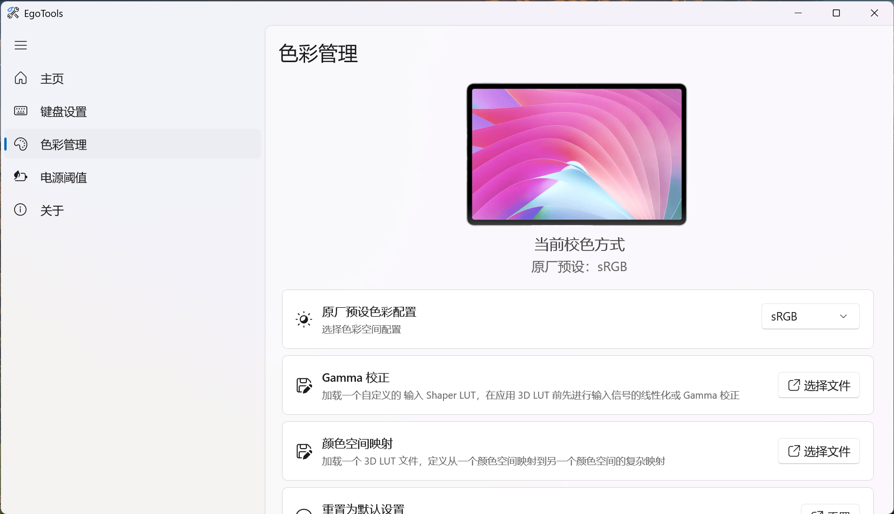

<h1 align="center">EgoTools</h1>
✨ 华为 Matebook E Go 第三方调节工具 ✨

## 感谢
本项目的核心组件由 [dantmnf](https://github.com/dantmnf) 大佬开发的 [goodies](https://github.com/matebook-e-go/goodies) 组件制作而来，请多多Star!
## 📖 使用方法
1. 前往 Release 发布页面下载最新本的压缩包；
2. 解压后运行文件夹中的 EgoTools.exe 即可。

## 📌 已完成的功能
  
| 状态 |          功能                        |
|:--------:|:-------------------------------:|
|    ✅     | 设备信息查看                    |
|    ✅     | 键盘分离设置                    |
|    ✅     | 屏幕色彩管理                    |
|    ✅     | 电池阈值设置                    |

## ⚡ 特性
* 使用 WinUI3 构建，原生应用体验；
* 更多特性，正在陆续更新...

## 截图

	
    
    
    
        

## 支持
* 欢迎前往[Issue](https://github.com/SaKongA/EgoTools/issues)提出您遇到的任何问题；
* Star this repo！